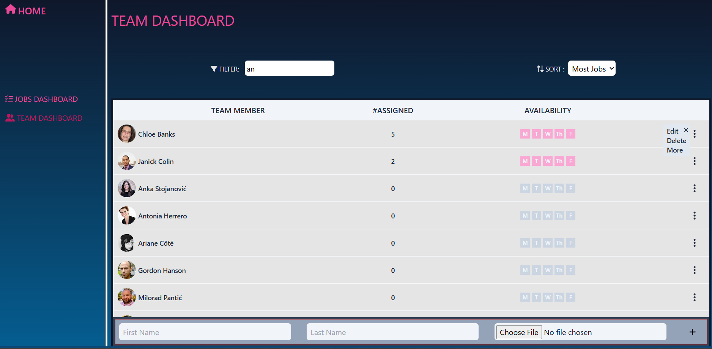
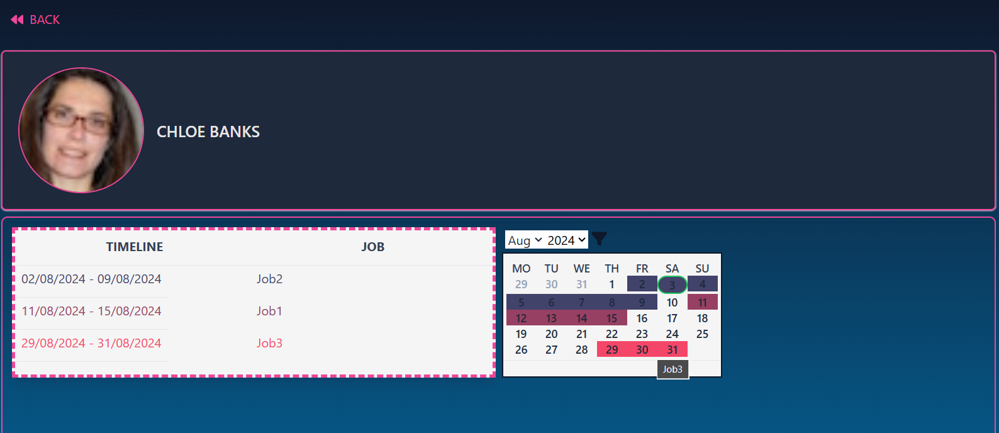
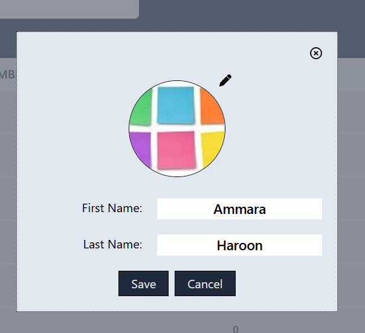
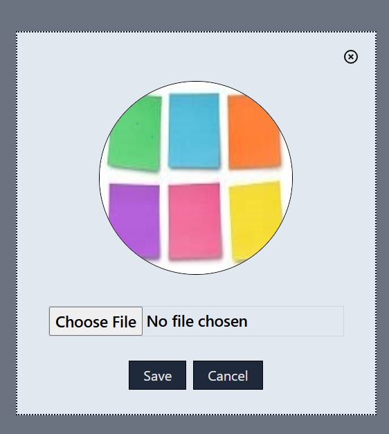
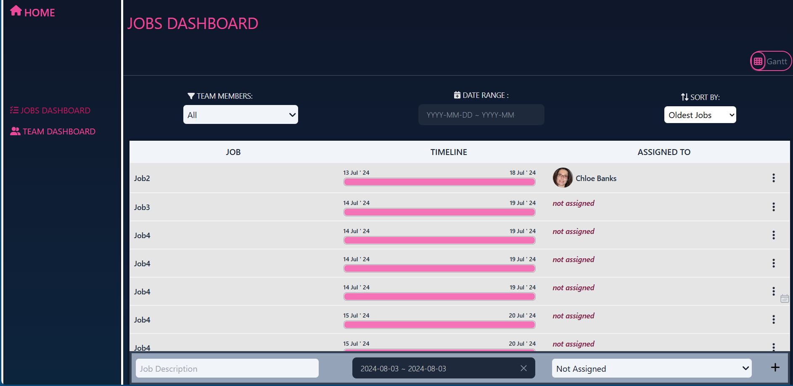
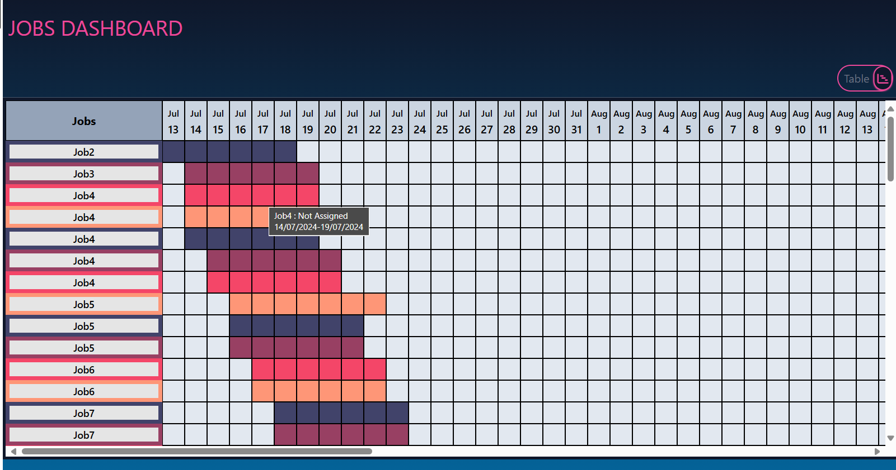
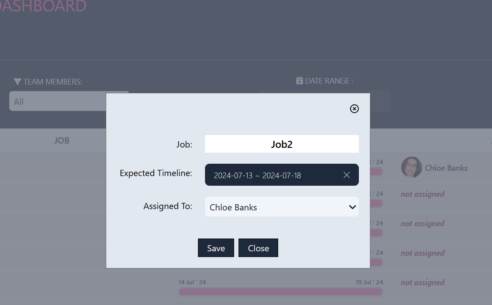
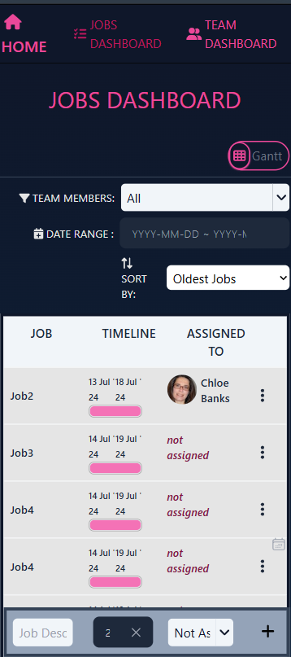
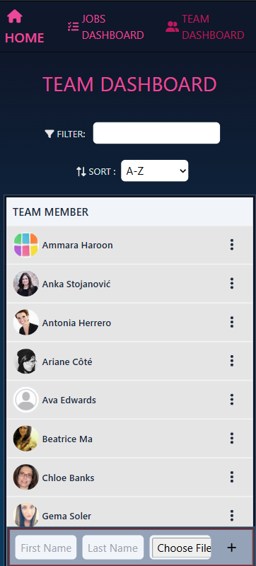
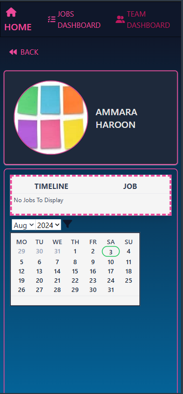

# Resource Planner App

## Demo & Snippets

### Team Dashboard

### Jobs Dashboard

### Mobile View

## Requirements / Purpose

### MVP

You task is to build a Resourcing API using the Java Spring Boot framework, that allows consumers to assign temps to jobs.

Endpoints
POST /jobs - Creates a job
PATCH /jobs/{id} - Updates job, endpoint should be used to assign temps to jobs
GET /jobs - Fetch all jobs
GET /jobs?assigned={true|false} - Filter by whether a job is assigned to a temp or not
GET /jobs/{id} - (id, name, tempId, startDate, endDate)
POST /temps - Create a temp
GET /temps - List all temps
GET /temps?jobId={jobId} - List temps that are available for a job based on the jobs date range -GET /temps/{id} - get temp by id (should also display jobs they've been assigned to)
Payloads
// GET /jobs/{id}
{
id: ...,
name: ...,
startDate: ...,
endDate: ...,
temp: {
id: ...,
firstName: ...,
lastName: ...,
} // temp can also be null if a temp hasn't been assigned to the job
}

// GET /temps/{id}
{
id: ...,
firstName: ...,
lastName: ...,
jobs: [{
id: ...,
name: ...,
startDate: ...,
endDate: ...,
}, ...] // can be empty if temp hasn't been assigned to jobs
}

### Assumptions

Temps can only have one job at a time (can't be doing 2 jobs on the same date)
Temps can have many jobs, and job can have 1 temp assigned
Should be able to assign existing temps to jobs via the POST /jobs & PATCH /jobs/{id}
You must use a relational database.

### Stack used

- React Typescript (frontend)
- Java Spring (backend)
- MYSQL (database)
- Google Storage Bucket (to store Profile Pictures)

## Build Steps

A number of components have been built from scratch to support the app functionality.

- Weekly View
- Monthly View
- Gantt Chart
- Combo Box that can display photos along with names of team members
- Timeline Progress for jobs
- Options Menu

## Features

- Adds, deletes, updates and view all jobs.
- Adds, deletes, updates and view all team members.
- Assigns jobs to team members depending on their availability during the job timeline.
- Job cannot be assigned to a team member who is not available during the timeline of the job.
- Jobs can be sorted alphabetically or by start dates (ascending and descending) and grouped by team members.
- Jobs can be filtered by assigned team members.
- Jobs Dashboard shows job descriptions, their start and end dates, their timeline progress and the person the job has been assigned to.
- Team dashboard shows names of all the team members, number of jobs assigned to them and their availability for next 5 working days.
- Team members can be sorted alphabetically by their names and number of jobs assigned to them.
- Team members names can be dynamically filtered by search-box
- A color coded gantt chart shows the timeline for all jobs on a calendar. A tooltip gives further description for each row in gantt chart.
- Options menu are available for both jobs and team members to edit and delete them.
- Team Member details can be viewed using the more button in options menu that opens up a list and calendar with jobs marked on it.

## Known issues

- The profile picture links do not get updated immediately like other fields. This might be duw to delay in updating link of the uploaded image

## Future Goals

- Add authentication and a login system to allow the app to be used by multiple users.
